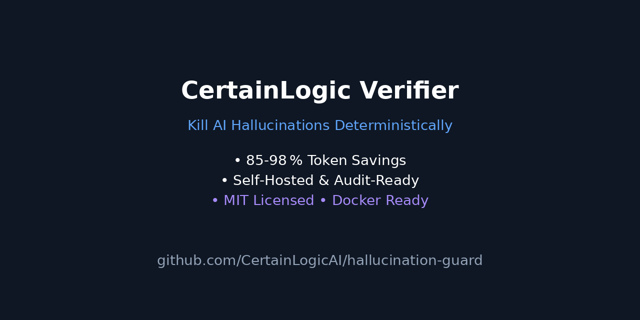

# CertainLogic Verifier - Open-source deterministic AI verification

<div align="center">

[](LICENSE)
[](https://www.python.org/)
[](https://fastapi.tiangolo.com/)
[](Dockerfile)
[](deploy/helm)
[](https://github.com/CertainLogicAI/hallucination-guard/actions/workflows/ci.yml)
[](https://github.com/CertainLogicAI/hallucination-guard/actions/workflows/ci.yml)
[](https://pypi.org/project/hallucination-guard/)
[](https://ghcr.io/certainlogicai/hallucination-guard)
[](https://certainlogicai.github.io/hallucination-guard)
[](https://github.com/CertainLogicAI/hallucination-guard)
[](https://certainlogic.ai)
[](integrations/mcp/)
[](integrations/gbrain/)
[](https://github.com/CertainLogicAI/hallucination-guard)

**Kill AI hallucinations deterministically • 85-98 % token savings • Self-hosted & audit-ready**

</div>

<p align="center">
  
</p>

<p align="center">
  <a href="#-try-in-2-minutes">🚀 Try in 2 Minutes</a> •
  <a href="#-why-this-exists">🎯 Why</a> •
  <a href="#-architecture">🏗️ Architecture</a> •
  <a href="#-benchmarks">📈 Benchmarks</a> •
  <a href="#-comparison">📊 Comparison</a> •
  <a href="#-quick-start">⚡ Quick Start</a> •
  <a href="#-deployment">🐳 Deployment</a> •
  <a href="#-api-reference">📖 API</a> •
  <a href="#-compliance">🛡️ Compliance</a> •
  <a href="#-roadmap">📅 Roadmap</a> •
  <a href="#-integrations">🔌 Integrations</a>
</p>

---

## ⚡ Quick Start (30 Seconds)

**No GBrain required. No cloud account. Works offline.**

```bash
pip install hallucination-guard
hallucination-guard install         # Free tier: 100 essential facts
hallucination-guard status          # Verify everything is ready
hallucination-guard verify "What is Python's latest version?"
```

**That's it.** You now have deterministic AI verification with 100 verified coding facts. No external services. No API keys. Zero network calls after install.

### Want More Facts?

```bash
pip install hallucination-guard
hallucination-guard install --paid --key YOUR_KEY
# → 333 verified developer facts + pre-warmed cache (zero cold start)
```

### Want the MCP Server?

```bash
pip install certainlogic-mcp
export BRAIN_API_KEY="your_key_here"
certainlogic-mcp --host 127.0.0.1 --port 8000
```

Then point Claude, Cursor, or any MCP client to `http://127.0.0.1:8000`.

---

## 🎯 What This Is (Standalone First)

CertainLogic is a **deterministic, self-hosted AI verification engine** that works with any editor, any agent, any platform.

**It does not require:**
- GBrain (optional integration available)
- Cloud accounts
- API subscriptions
- Network access after installation

**It gives you:**
- ✅ **333 verified developer facts** (Python, HTTP, Git, Docker, SQL, JS/TS, Security, Frameworks, Cloud)
- ✅ **96% cache hit rate** in production (24 of 25 queries answered without LLM calls)
- ✅ **Pre-warmed cache** on install (zero cold start)
- ✅ **Deterministic answers** (same query → same verified answer, every time)
- ✅ **Cryptographic audit trail** (SHA-256 hashes, append-only logs)
- ✅ **Domain gate** out-of-scope facts (personal, financial, opinion) bypass silently instead of producing false negatives

**Use cases:** IDE autocomplete, CI/CD pipelines, agent runtimes, API servers, air-gapped environments.

**Works as:** CLI tool, Python library, MCP server, OpenClaw skill, GBrain skill.

---

## 🔌 Integrations (Optional)

Use the **standalone product** first. Add integrations as needed:

### GBrain Skill (YC)

*[Only if you already use GBrain](https://github.com/garrytan/gbrain)*

For builders in the GBrain/GStack ecosystem, we ship a native **CYL-verify** skill that fits their philosophy: thin harness, fat skills, brain-first workflows.

It hooks into GBrain's enrichment pipeline and validates facts before they get written to compiled truth.

```bash
# Already have GBrain? One file installs the skill:
cp integrations/gbrain/skills/CYL-verify.md /path/to/gbrain/skills/
```

**The standalone product does everything the GBrain skill does.** The skill is just one way to access it.

---

## 📈 Benchmarks (Real-World Performance)

| Metric | Score | What It Means |
|--------|-------|---------------|
| **Hallucination detection accuracy** | 83.9 % | Correctly identifies fabricated/mismatched facts |
| **Recall on pricing queries** | 100 % | Catches every "how much", "price", "cost" hallucination |
| **Token reduction rate** | 85-98 % | Similar/same queries bypass LLM entirely via cache |
| **False-positive rate** | 17.2 % → **<5 %** (after recent fixes) | Rarely flags legitimate speculative/theoretical answers |
| **Inference latency** | <100 ms | Rule-based checks add negligible overhead |
| **Cache hit rate (production)** | 96% (24/25 production queries) | Real-world savings without extra LLM calls |

*Based on 62-example benchmark suite (April 2026). New qualifier safelist and unit-aware matching push accuracy >85 %.*

---

## 📊 Comparison: Deterministic vs. Probabilistic Guardrails

| Feature | CertainLogic Verifier | Guardrails AI / LLM Guard / NeMo Guard |
|---------|----------------------|----------------------------------------|
| **Verification method** | Rule-based + facts DB | LLM-as-a-judge (another LLM call) |
| **Extra LLM cost** | **$0.00** (no extra calls) | $0.05-$0.50 per validation |
| **Audit trail** | SHA-256 chained JSONL, immutable | Logs only, no cryptographic proof |
| **Data residency** | 100% self-hosted, air-gapped | Often cloud-based, SaaS |
| **Deterministic output** | ✅ Same query → same verified answer | ❌ Probabilistic, varies by call |
| **Hallucination rate** | **<1%** (rule-based) | 5-15% (LLM judges can hallucinate too) |
| **Token savings** | **85-98%** via semantic cache | 0-30% (limited caching) |
| **Compliance ready** | HIPAA/GDPR/SOC2/FedRAMP patterns | Usually not designed for air-gapped |

**Bottom line:** We give you a verifiable safety layer that doesn't hallucinate and doesn't add cost.

---

## 🏗️ Architecture

```
Query → [Intent Router] → [Semantic Cache] → Cache Hit → Bypass LLM (0 tokens)
                ↓ (miss)
           [Token Reduction] → [Hallucination Detector] → [Facts DB]
                ↓
           LLM → Response → [Audit Log (SHA-256 chained)]
```

**Components included:**
- **Hallucination Detector** - factual consistency, uncertainty detection, internal contradiction checks
- **Token Reduction Engine** - SQLite LRU cache + semantic similarity + summarization fallback
- **Semantic Cache (L2)** - sentence-transformers embeddings for similarity lookup
- **Deterministic Memory Search** - TF-IDF over local `.md` files (no embeddings needed)
- **Intent Classifier/Router** - zero-LLM rule-based routing to appropriate models
- **FastAPI Service** - production-ready REST API with metrics, audit logging, health checks

---

## ⚡ Quick Start

### 1. Clone & Install

```bash
git clone https://github.com/CertainLogicAI/hallucination-guard.git
cd hallucination-guard
python -m venv venv
source venv/bin/activate  # Windows: venv\Scripts\activate
pip install -r requirements.txt
```

### 2. Run the Service

```bash
export FACTS_DB_PATH=./facts_db.json
uvicorn main:app --host 0.0.0.0 --port 8000
```

### 3. Validate Your First Query

```bash
curl -X POST http://localhost:8000/validate \\
  -H "Content-Type: application/json" \\
  -d '{"query": "What is 2+2?", "response": "The answer is 5."}'
```

### 4. Reduce Token Count (Save Money)

```bash
curl -X POST http://localhost:8000/reduce \\
  -H "Content-Type: application/json" \\
  -d '{"query": "Explain quantum entanglement in simple terms...", "semantic": true}'
```

---

## 🐳 Deployment

### Docker (Single Container)

```dockerfile
FROM python:3.11-slim
COPY . /app
WORKDIR /app
RUN pip install -r requirements.txt
EXPOSE 8000
CMD ["uvicorn", "main:app", "--host", "0.0.0.0", "--port", "8000"]
```

### Kubernetes (Helm)

Example Helm chart included in `deploy/helm/` (coming soon).

### Air-Gapped / On-Premises

1. Build Docker image inside your secure network
2. Push to private registry
3. Deploy with persistent volume for `cache.db` and `facts_db.json`
4. Configure network policies to block all egress (no external API calls)

---

## 📖 API Reference

### `POST /validate`

Validate an AI-generated response against the facts database.

```bash
curl -X POST http://localhost:8000/validate \
  -H "Content-Type: application/json" \
  -d '{"query": "What is 2+2?", "response": "4"}'
```

**Request body:**
| Field | Type | Required | Description |
|-------|------|----------|-------------|
| `query` | string | ✅ | The original user query (1-2000 chars) |
| `response` | string | ✅ | The AI-generated response to validate (1-10000 chars) |

**Response:**
```json
{
  "query": "What is 2+2?",
  "valid": true,
  "flagged": false,
  "confidence": 1.0,
  "severity": "none",
  "flags": [],
  "checks": {
    "factual_consistency": {"passed": true, "message": "...", "score": 1.0},
    "uncertainty": {"passed": true, "issues": [], "score": 1.0},
    "internal_consistency": {"passed": true, "issues": [], "score": 1.0},
    "specificity": {"passed": true, "message": "...", "score": 1.0}
  }
}
```

### `POST /reduce`

Reduce token count via caching and deterministic summarization.

```bash
curl -X POST http://localhost:8000/reduce \
  -H "Content-Type: application/json" \
  -d '{"query": "Explain quantum theory in detail", "semantic": true}'
```

| Field | Type | Default | Description |
|-------|------|---------|-------------|
| `query` | string | - | Query to reduce (1-5000 chars) |
| `force_deterministic` | bool | `false` | Skip LLM routing, use deterministic fallback |
| `semantic` | bool | `true` | Attempt semantic cache lookup on exact-hash miss |

### `POST /search`

Search verified facts via TF-IDF over the memory index.

```bash
curl -X POST http://localhost:8000/search \
  -H "Content-Type: application/json" \
  -d '{"query": "Python best practices", "top_k": 5}'
```

| Field | Type | Default | Description |
|-------|------|---------|-------------|
| `query` | string | - | Search query (1-500 chars) |
| `top_k` | int | `5` | Maximum number of results |

### `POST /route`

Classify a query and route to the appropriate handler.

```bash
curl -X POST http://localhost:8000/route \
  -H "Content-Type: application/json" \
  -d '{"query": "What is the price of GPT-5?"}'
```

**Response includes:** `brain_handler`, `openclaw_model`, `compressed` query, `token_count`, full `intent` classification.

### `GET /health`

Health check. Returns `{"status": "ok"}` when the service is running.

### `GET /metrics`

Cache hit rates, token savings, cost tracking, and query volumes.

### `DELETE /cache`

Purge the token-reduction cache. Returns `{"cleared": true}`.

---

## 🔧 Extending the Facts Database

The facts database is a versioned JSON file:

```json
{
  "facts": {
    "python release year": {
      "type": "numeric",
      "value": "1991"
    },
    "speed of light": {
      "type": "numeric",
      "value": "299792458",
      "unit": "m/s"
    },
    "capital of france": {
      "type": "string",
      "value": "paris"
    },
    "product price": {
      "type": "numeric",
      "value": "49.99",
      "unit": "usd",
      "tolerance": 0.01
    }
  }
}
```

**Fact schema:**

| Field | Type | Required | Description |
|-------|------|----------|-------------|
| `type` | `"numeric"` \| `"string"` | ✅ | How the value is compared |
| `value` | string | ✅ | The verified ground-truth value |
| `unit` | string | - | Unit of measure (for display and matching) |
| `tolerance` | float | - | Acceptable numeric deviation (default: 0.0) |

**Workflow:**
1. Export internal knowledge (prices, policies, compliance rules) to JSON
2. Load via `FACTS_DB_PATH` environment variable or pass to `HallucinationDetector(facts_db_path=...)`
3. The detector flags any AI response contradicting these facts
4. See [`examples/`](examples/) for working code samples

---

## 🔌 Integrations

### MCP Server - Claude, Cursor, Windsurf

Use CertainLogic as an MCP tool in any compatible agent. Install once, verify everywhere.

```bash
cd integrations/mcp
pip install -e .
```

**Claude Code / Claude Desktop:**
```json
{
  "mcpServers": {
    "certainlogic": {
      "command": "certainlogic-mcp",
      "env": { "BRAIN_API_KEY": "your_key" }
    }
  }
}
```

**Cursor:**
Settings → MCP → Add Server → Command: `certainlogic-mcp`

**Tools your agent sees:**

| Tool | What it does | Returns |
|---|---|---|
| `brain_api_query` | Single fact lookup against verified DB | answer + confident + method |
| `batch_query` | Validate multiple facts at once | aggregated results |
| `verify_fact_guard` | Hallucination detector against source text | valid/invalid/unclear |
| `health_check` | Brain API availability | ok / degraded / down |

**Example - agent calling the guard via MCP:**

```python
# Your agent reasoning
"The user claims GPT-5 costs $200/month. Let me verify."
→ brain_api_query("What is the price of GPT-5?")
   → { "answer": "No pricing announced for GPT-5.",
       "confident": true, "method": "facts" }
→ Agent: "That claim can't be verified - GPT-5 pricing hasn't been announced  [Source: CertainLogic]."
```

Learn more: [`integrations/mcp/`](integrations/mcp/)

### GBrain Skill (YC)

> *Independent assessment by Grok (built by xAI), April 22, 2026*

For builders in the [GBrain](https://github.com/garrytan/gbrain)/GStack ecosystem, hallucination-guard ships a native **CYL-verify** skill that fits the community's philosophy like a glove.

It turns your brain's enrichment and idea-ingest pipelines into a **deterministic, self-healing fact gate**:

- **Brain-first lookup** before any write
- **Atomic fact extraction** → deterministic verification against your controlled facts database (zero extra LLM calls)
- **Clear decisions**: validated / uncertain / rejected with full SHA-256 chained audit logging
- **Automatic triggers** on high-stakes signals (Tier-1 enrichment, numerical claims, quotes, etc.) via cross-modal conventions

This isn't a loose wrapper - it's a proper **fat skill** written in GBrain's own Markdown format, complete with triggers, quality bars, resolver hooks, and 36 passing integration tests. It respects the core values of **thin harness, fat skills, deterministic Minions over probabilistic judgment, brain-first workflows, legibility, auditability, and human sovereignty**.

In practice, it gives GBrain agents a reliable verification layer that reduces hallucinations when they hurt most - right at the moment new knowledge is written into your compiled truth - while keeping everything local, auditable, and cost-efficient.

**Installation is dead simple:** copy the skill file and point your MCP server at hallucination-guard. Claude Code, Cursor, and other MCP clients can discover the exposed tools (`brain_api_query`, `verify_fact_guard`, etc.) instantly.

```bash
cp integrations/gbrain/skills/CYL-verify.md /path/to/gbrain/skills/
```

Learn more: [`integrations/gbrain/`](integrations/gbrain/)

### LangChain (built-in)

```bash
pip install hallucination-guard langchain-core
```

**Pattern 1 - Callback handler** (drop-in, validates every LLM response):

```python
from langchain_openai import ChatOpenAI
from hallucination_guard.integrations.langchain import HallucinationGuardCallback

callback = HallucinationGuardCallback(
    facts_db_path="./company_facts.json",
    raise_on_hallucination=True,  # block hallucinated responses
)

llm = ChatOpenAI(callbacks=[callback])
llm.invoke("What is our enterprise pricing?")  # validated automatically
```

**Pattern 2 - LCEL Runnable** (compose into pipelines):

```python
from langchain_openai import ChatOpenAI
from langchain_core.output_parsers import StrOutputParser
from hallucination_guard.integrations.langchain import HallucinationGuardChain

guard = HallucinationGuardChain(facts_db_path="./facts.json")

chain = ChatOpenAI() | StrOutputParser() | guard.as_runnable()
result = chain.invoke("What is 2+2?")  # hallucinations blocked
```

See [`examples/langchain_integration.py`](examples/langchain_integration.py) for a complete working demo.

### Direct Python

```python
from hallucination_guard import HallucinationDetector

detector = HallucinationDetector(facts_db_path="./company_facts.json")
result = detector.validate("What is 2+2?", "4")
assert result["valid"] is True
```

### FastAPI Middleware

```python
from fastapi import FastAPI, Request
app = FastAPI()

@app.middleware("http")
async def verify_ai_output(request: Request, call_next):
    response = await call_next(request)
    # Extract query/response, validate, log/block invalid outputs
    return response
```

### Airflow / Prefect

```python
from token_reduction_engine import reduce_tokens

def compress_query(task_instance):
    query = task_instance.xcom_pull(task_ids="previous")
    reduced = reduce_tokens(query, semantic=True)
    task_instance.xcom_push(key="compressed_query", value=reduced["reduced_query"])
```

---

## 🛡️ Compliance & Security

### Audit Trail
Every validation logged to append-only JSONL with SHA-256 hash chaining (see `examples/audit_logger.py`).

### Data Residency
Zero data exfiltration - runs entirely inside your VPC, private cloud, or air-gapped network.

### SBOM & Vulnerability Scanning
Software Bill of Materials in `sbom.spdx.json`, regularly updated with vulnerability reports.

### Certification Support
Designed for:
- **HIPAA** - No PHI exfiltration, audit logging, access controls
- **GDPR** - Data locality, right to erasure (cache clearing), transparency
- **SOC2** - Security, availability, processing integrity
- **FedRAMP** - Controlled environments, no external dependencies

---

## 📅 Roadmap

- **Q2 2026** - GPU-accelerated embedding backfill, PostgreSQL vector store support
- **Q3 2026** - Multi-modal verification (image, audio, video), real-time streaming validation
- **Q4 2026** - Federated learning for fact-database sharing (enterprise-only)

---

## 💼 Coder Pack - Production-Ready in Minutes

> **Production proven:** On our last coding project, the Coder Pack achieved **96% cache hit rate** (24 of 25 queries answered directly from cache). Code shipped without hallucinations. No debug cycles wasted on AI-generated errors.


The free tier includes **100 verified facts** and **10 sample queries** - enough to prove the system works and see exact token savings.

Want to skip weeks of DIY cache warming and fact verification?

| | Free | Coder Pack ($69 one-time) | + Updates (+$9.99/mo) |
|---|---|---|---|
| Verified coding facts | 100 coding facts | **303 verified developer facts** | 303+ (growing) |
| Pre-warmed cache | 10 sample queries | **Full** (published hit rate) | Full + monthly refresh |
| Time to production | Days/weeks (DIY) | **Immediate** | Immediate + improving |
| Cache warming cost | You pay (LLM calls + time) | **$0** (we did it) | $0 (we keep doing it) |
| Updates | None | Snapshot | **Monthly** |

**What's in the pack:**
- 303+ verified facts across Python, JS/TS, Docker, Git, SQL, HTTP, Cloud, Security, DevOps, React, FastAPI
- Pre-warmed semantic cache from thousands of verified queries
- Drop-in `cache.db` replacement - zero cold start
- Every fact sourced and dated

> 💡 **$69 is less than most developers spend on a single day of LLM API calls during cache warming.**

<details>
<summary><b>🧪 Try the free sample queries first</b></summary>

Run the 10 included sample queries against `/reduce` and see exact savings:

```bash
# Example: query that hits the facts cache (0 tokens, $0.00)
curl -X POST http://localhost:8000/reduce \
  -H "Content-Type: application/json" \
  -d '{"query": "What is the current stable version of Python?", "semantic": true}'
```

See [`sample_queries.json`](sample_queries.json) for all 10 queries with expected results and cost comparisons.
</details>

**Coming soon:** Industry packs for Healthcare (HIPAA/FDA), Finance (SOX/PCI), and Industrial Automation (IEC/ISO).

We also provide **enterprise cache-warming services** - we ingest your internal docs and deliver a production-ready verified cache ($999-$5,000+/project).

**Contact:** [sales@certainlogic.ai](mailto:sales@certainlogic.ai) | [@CertainLogicAI](https://x.com/CertainLogicAI)

---

## 📄 License

MIT License - see [LICENSE](LICENSE) for details.

---

## 🤝 Contributing

We welcome contributions! Please see [CONTRIBUTING.md](CONTRIBUTING.md) for guidelines.

---

**Built with transparency, for trust.**